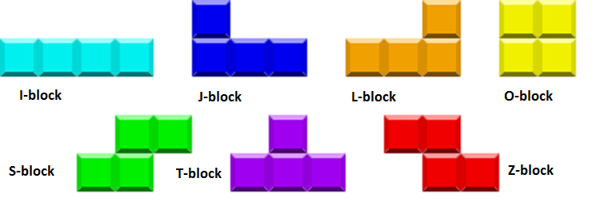

# Quadris

Quadris is a new and improved version of Tetris written in C++ with a graphics library X11


# How to Install

First, make sure you have the GCC and X11 library installed on your system

### GCC

Run the following to check your current version of GCC 
```
g++ -v
```
And if it is not available, please follow the instructions in [GNU's official website](https://gcc.gnu.org/install/) to install GCC

### X11

Before checking the installation, please try to run Quadris on your system to check if X11 is install (check the following section to compile and run Quadris).

If it is not installed, please refer to the appropriate link in the list below for your specific system:

1. Ubuntu:  [Stack Overflow](https://askubuntu.com/questions/213678/how-to-install-x11-xorg)
2. Mac OS: [XQuartz](https://www.xquartz.org/)
3. Windows: [JLab](https://cc.jlab.org/windows/X11onWindows)

# How to Run

If you have verified that everything is set up on your machine, please enter the following commands in your terminal (Powershell for Windows) to play the game

```
cd src
make
./quadris
```

# How the Game Works

Quadris has similar features as Tetris, with the original 7 types of blocks, which we will name them here:



In addition, it features several new implementations, which will be explained below

## Level System

In Quadris, there are 5 available levels for the player to choose at the beginning of the game, with the default being Level 0

**Level 0**: all blocks follows a generation pattern of I->J->L->S->Z->O->T

**Level 1**: S and Z blocks are generated with a probability of 1/12 each, and the other blocks with a probability of 1/6 each.

**Level 2**: All blocks are generated with equal probability

**Level 3**: S and Z blocks are generated with a probability of 2/9 each, and the other blocks with a probability of 2/9 each. In addition, all blocks become **heavy**, meaning that any horizontal move will incur a downward move

**Level 4**: In addition to the rules of Level 3, every 5 blocks that you place without any row will create a 1x1 block that will be dropped in the middle of the game board

## Scoring System

In the top of the game board, current game score and highest game score will be displayed as such


The score is calculated as such:
- When a line (or multiple lines) is cleared, the scored points are calculated as **(current level + number of lines cleared)<sup>2</sup>**
- Additionally, when a whole block is cleared, you get additional point as **(level where the block is generated + 1)<sup>2</sup>**

## Start of Game

When you create a new game using the command 
```
./Quadris
```

You can add a couple of additional parameters such as
- -text: Runs the game in text-only mode, where the default behaviour is text + graphic
- -scriptfile xxx: Uses xxx as source of blocks in level 0
- -startlevel n: Starts the game in level n, where the default option is level 0

## Game commands

The game features the original commands from Tetris in addition to some more complicated commands
| command          | action                                          |
|------------------|-------------------------------------------------|
| left             | moves the current block to the left             |
| right            | moves the current block to the right            |
| down             | moves the current block down one block          |
| clockwise        | rotates the clock in clockwise direction        |
| counterclockwise | rotates the clock in counter-clockwise diretion |
| drop             | drops the current block and generate a new one    |
| levelup          | increases the difficulty level of the game by one |
| leveldown        | decreases the difficulty level of the game by one |
| restart          | clears the board and starts a new game            |
| hint             | suggests a landing place for the current block    |
| AItakeover       | let an AI take over the commands                  |


# Authors

Special thanks to the other contributors:
- Darren Li
- Samuel Li
